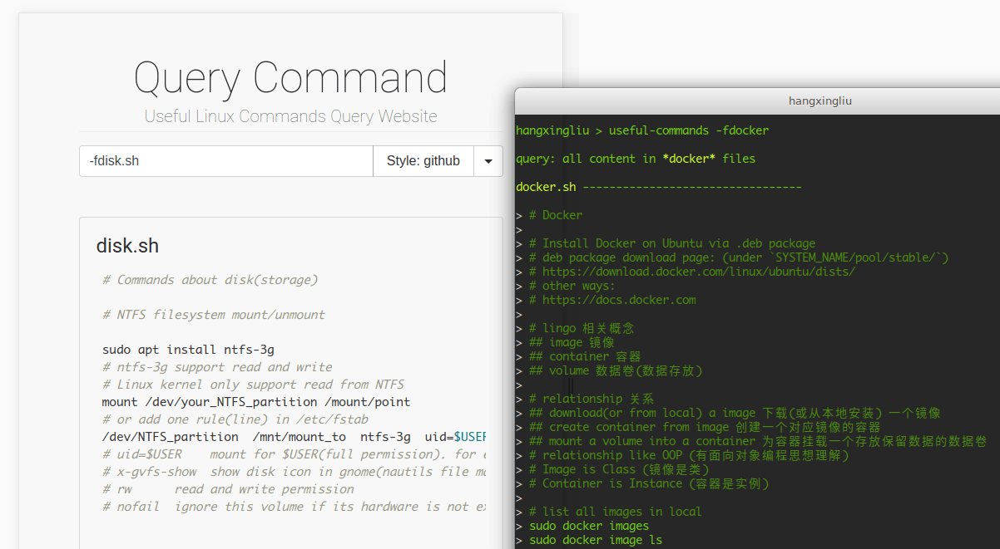

# Useful Linux Commands

<a href="https://www.npmjs.com/package/useful-linux-commands">

</a>

A collection of useful linux commands that can be queried from the command line and within the browser.

The commands and comments inside consists of two languages (English, 简体中文)



## Install

``` bash
git clone https://github.com/hangxingliu/useful-linux-commands.git;
cd useful-linux-commands;
sudo npm install --global
```

## Usage

### As a command line toolkit (CLI)

``` bash
useful-commands keyword ...  # query commands
useful-commands --help       # get help information
```

the query ways:

``` bash
useful-commands ssh
useful-commands ssh git
useful-commands purge -fdocker # `purge` in docker command set
useful-commands ssh -a6 -b5 # within 5 lines before and 6 lines after 
useful-commands -fdocker # all commands in docker command set
```

### As a web server

default port is **10765**

[PM2 deploy guide](docs/PM2_DEPLOY.md)

``` bash
# Way 1: launch server directly
PORT=10765 useful-commands-server

# Way 2: launch server by pm2
PORT=10765 pm2 start ecosystem.prod.yaml; # ecosystem.prod.yaml is profile for production mode

# Way 3: launch server by docker
sudo docker build -t cmd-query-server .
sudo docker run -p 80:10765 -m 256M --memory-swap 1G -d \
	--name my-cmd-query-server cmd-query-server
```

the query ways:

``` bash
# in browser:
# input keyword or flag in search input box

# in terminal:
wget http://domain/keywords -O
wget http://domain/keywords?color -O
curl http://domain/filename/keywords?a=5&b=1
curl http://domain/help
```

## Contribute

- [Commit issue](https://github.com/hangxingliu/useful-linux-commands/issues)
- [Pull request](https://github.com/hangxingliu/useful-linux-commands/pulls)
- [Give me coffee via Paypal](https://www.paypal.me/hangxingliu)

References:

- [Project Structure](docs/PROJECT-STRUCT.md)


## Author

[LiuYue @hangxingliu](https://github.com/hangxingliu)

## License

[GPL-3.0](LICENSE)
